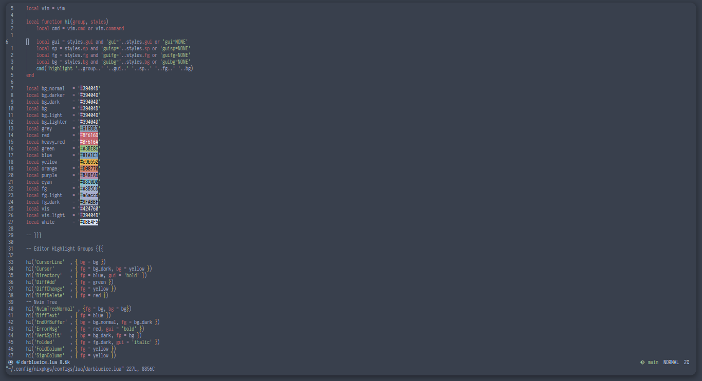

## DarkBlue Ice for vim



### A Beautiful theme for vim with dark blue and ice colors distributed in a harmonic way.

---
* Warning: DarkBlue Ice for vim is using some colors of Nord, since DarkBlue Ice doesn't have any pallet wtih colors like green, yellow etc.
## How to install
* Download the `darkblueice.vim` file on [github releases](https://github.com/Dedsd/DarkBlue-Ice-for-vim/releases)
* Move `darkblueice.vim` to `~/.vim/colors`
* Make sure your `vimrc` or `.vim` file looks like this:
```
colorscheme darkblueice
set termguicolors
```

---

Made by [André V.](https://github.com/Dedsd) and [Mateus Cavalcanti](https://github.com/Mateus-Cavalcanti)
